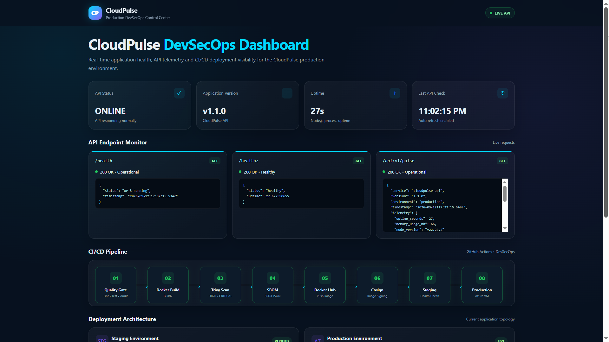

# CloudPulse API App

A production-grade Node.js service engineered with a full **DevSecOps CI/CD Pipeline**. The pipeline automates code quality gates, static vulnerability analysis, container security hardening, supply chain provenance, and immutable production delivery on Azure.



---

## Architecture & DevSecOps Workflow

```
[ Push / PR ] 
      │
      ▼
1. Quality Gate (ESLint, NPM Audit, Unit Tests, Gitleaks)
      │
      ▼
2. Container Security (Buildx, Trivy CVE Scan, SBOM, Cosign Keyless Signing)
      │
      ▼
3. Ephemeral Staging (Container Boot Verification, Curl Health Probe)
      │
      ▼
4. Production Delivery (SSH to Azure VM, Pull via Immutable Image Digest)

```

---

## Security & Reliability Controls

* **Immutable Deployments:** Containers are deployed strictly by cryptographic digest (`sha256`), eliminating mutable tag risks (`latest`).
* **Supply Chain Security:** Generates SPDX SBOM and signs container images keylessly using Sigstore Cosign.
* **Shift-Left Vulnerability Scanning:** Builds fail automatically if Gitleaks detects leaked secrets or Trivy identifies `HIGH` or `CRITICAL` CVEs.
* **Ephemeral Staging Gate:** Spins up a local test container on the GitHub Runner to verify startup integrity and health checks prior to deployment.

---

## Local Development

### Prerequisites

* Node.js 22+
* Docker

### Run Locally

```bash
# Install dependencies
npm ci

# Run linter and tests
npm run lint
npm test

# Start the application
npm start

```

### Run via Docker

```bash
# Build the container
docker build -t cloudpulse-api .

# Run the container
docker run -d -p 3000:3000 --name cloudpulse-api cloudpulse-api

# Check health endpoint
curl http://localhost:3000/health

```

---

## Deployment Configuration

Production deployment requires the following GitHub repository secrets and variables:

| Type | Name | Description |
| --- | --- | --- |
| **Secret** | `DOCKERHUB_TOKEN` | Access token for Docker Hub registry |
| **Secret** | `AZURE_VM_SSH_KEY` | Private SSH key for Azure VM access |
| **Variable** | `DOCKERHUB_USERNAME` | Docker Hub namespace/account |
| **Variable** | `AZURE_VM_HOST` | Public IP or FQDN of the Azure target |
| **Variable** | `AZURE_VM_USER` | Admin username on the Azure host |


---
